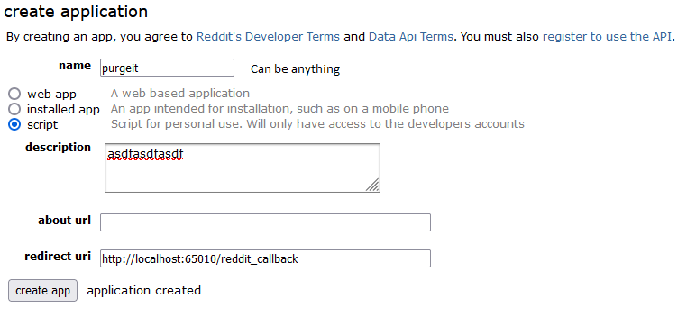
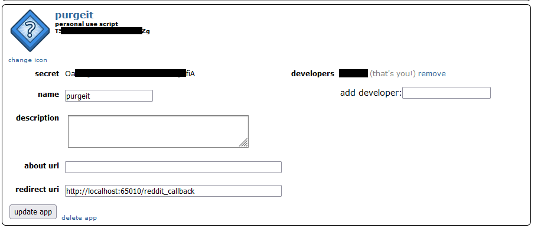

# purgeit
Purge your reddit history

The first pass will change the conent of your comments to '#'.  The second will delete them (give it a few days before running that.

## Create an app

https://www.reddit.com/prefs/apps/

Create a script type application as follows:

## Configure .env

Client id and secret are from your application, username and password are yours.

You can give a garbage useragent to theoretically mess with their tracking, though there's no way to know if they care. It's also possible they may mass undo these changes if they see a useragent like that.

Setting RUN_DELETE to True will delete any comments with the '#' body.

## Run

`pip3 install -r requirements.txt`

`python3 main.py`